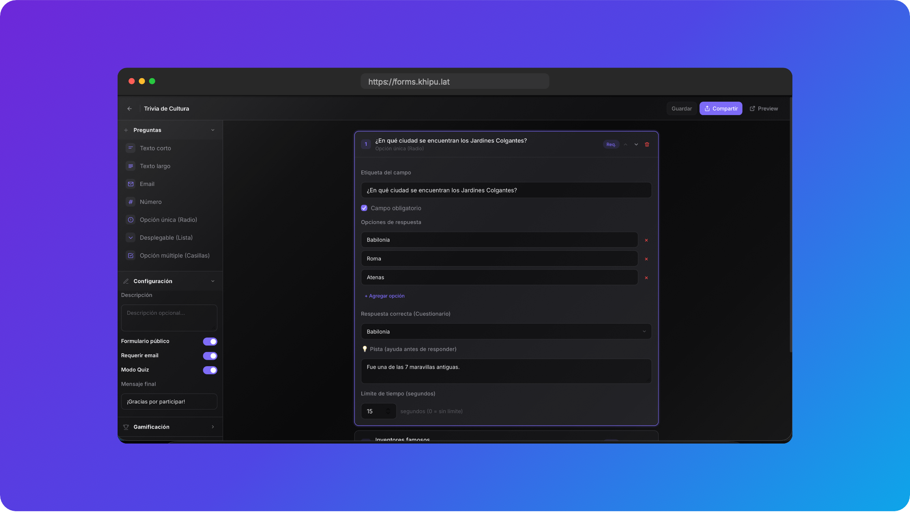

#  Khipu Forms

> **Smart SaaS Form Engine & Gamified Quiz Platform.**
> Transforma formularios y encuestas tradicionales en experiencias interactivas, secuenciales o gamificadas de alto rendimiento. Elige entre vista clásica, secuencial por tarjetas o la experiencia interactiva tipo Duolingo con vidas, rachas y explicaciones pedagógicas en vivo.

---

## 📷 Vista Previa de la Plataforma



---

## 🦙 ¿Qué es Khipu Forms?

**Khipu Forms** es un motor SaaS de formularios de última generación enfocado en maximizar el *engagement* y la retención de usuarios. Ideal para investigadores, educadores, profesionales de marketing y empresas, la plataforma rompe la fricción de la recolección de datos estática al permitir a los creadores adaptar la interfaz al propósito exacto del formulario, desde una encuesta de NPS corporativa hasta un examen de certificación gamificado de alta presión.

---

## 🚀 Características Principales

### 🎮 1. Motor de Gamificación Avanzado (*Interactive Pro*)
Lleva el aprendizaje y la evaluación al siguiente nivel con una experiencia interactiva tipo Duolingo guiada por nuestra mascota **Llama Khipu**:
- **Sistema de Vidas (Initial Lives):** Configura un límite de vidas (de 1 a 5 vidas). Cada respuesta incorrecta restará una vida, ideal para exámenes estrictos o certificaciones.
- **Rachas e Incentivos Visuales:** Muestra animaciones y rachas de respuestas correctas consecutivas para mantener alta la motivación del usuario.
- **Mascota Dinámica (Llama Khipu):** La mascota reacciona en tiempo real a las acciones del usuario (feliz en aciertos, triste en errores y sabia en modo tutor).
- **Fundamentación Pedagógica:** Agrega explicaciones detalladas para cada opción que aparecerán inmediatamente después de responder, reforzando el aprendizaje instantáneo.

### 🎨 2. Tres Modos de Presentación Dinámicos
Cambia la visualización del formulario con un solo clic según el perfil de tu público:
- **Modo Clásico (Classic):** Estructura tradicional en formato de lista vertical. Excelente para encuestas extensas de investigación o formularios corporativos formales.
- **Modo Secuencial (Cards):** Muestra una sola pregunta a la vez en formato de tarjeta centralizada. Reduce drásticamente la fatiga cognitiva y aumenta las conversiones en dispositivos móviles.
- **Modo Interactivo Pro (Duolingo Style):** Todo el poder de la gamificación interactiva con vidas, pistas desbloqueables, barra de progreso interactiva y feedback inmediato.

### 🛠️ 3. Builder de Alto Nivel
Un editor visual responsivo con organización inteligente por **Acordeones de Configuración**:
- **Preguntas:** Agrega, clona, borra y reordena campos instantáneamente de forma interactiva.
- **Configuración Básica:** Habilita el modo Quiz, activa la visualización de puntaje al finalizar y edita mensajes de cierre personalizados.
- **Gamificación & Estilos:** Elige el modo de presentación, habilita pistas opcionales (*hints*) y configura vidas iniciales.
- **Seguridad & Privacidad:** Activa barreras de consentimiento informado, restringe respuestas repetidas mediante validación de correo y configura códigos de acceso privados.

### ⏱️ 4. Temporizadores y Pistas Inteligentes
- **Relojes de Urgencia:** Define límites de tiempo por pregunta (en segundos) con un temporizador dinámico en forma de píldora flotante que emite alertas visuales en rojo cuando el tiempo se agota.
- **Pistas Desbloqueables (Hints):** Inyecta tips o pistas que los participantes pueden leer de manera opcional si se encuentran bloqueados en una pregunta del quiz.

### 📊 5. Dashboard de Analítica & AI Insights
- **Monitoreo en Tiempo Real:** Visualiza las respuestas recibidas en el panel administrativo instantáneamente.
- **Síntesis con IA (AI Insights):** Analizador incorporado que utiliza modelos de inteligencia artificial para procesar tendencias de respuestas, detectar sentimientos predominantes y generar resúmenes automáticos.
- **Exportación Rápida:** Descarga todas las respuestas en formato **CSV** para integraciones analíticas externas (Excel, Google Sheets, R o Python).

---

## 🛠️ Stack Tecnológico

Khipu Forms ha sido edificado sobre una arquitectura de vanguardia en el ecosistema web, priorizando la robustez de tipos, velocidad de carga y micro-animaciones:

- **Framework:** [Next.js 16 (React 19)](https://nextjs.org/) utilizando App Router para renderizado híbrido óptimo.
- **Estilos:** [Tailwind CSS v4](https://tailwindcss.com/) y Vanilla CSS personalizados con variables de diseño CSS fluidas.
- **Base de Datos & Auth:** [Supabase SSR & Supabase JS client](https://supabase.com/) para una persistencia e integraciones seguras de bases de datos.
- **Manejador de Estado:** [Zustand](https://github.com/pmndrs/zustand) para la sincronización fluida y sin latencia en el editor.
- **Esquemas & Validación:** [Zod](https://zod.dev/) para asegurar consistencia estricta en el flujo de datos.
- **Generación de QR:** `qrcode.react` para generar accesos instantáneos a los formularios.
- **Iconografía:** Lucide React.

---

## 📁 Estructura del Proyecto

```bash
khipu-forms/
├── app/                  # Rutas y Endpoints de Next.js
│   ├── api/              # Endpoints para persistencia de formularios y respuestas
│   ├── builder/          # Interfaz visual del constructor de formularios
│   ├── dashboard/        # Panel de control de usuario y analíticas de respuestas
│   ├── f/                # Publicador / Visualizador responsivo de los formularios ([id])
│   ├── login/            # Sistema de autenticación integrada
│   ├── responses/        # Visualizador de datos históricos por formulario
│   ├── globals.css       # Estilos globales y tokens CSS adaptados a Tailwind v4
│   └── page.tsx          # Landing page promocional de la plataforma
├── lib/                  # Clientes API y utilidades del proyecto
│   ├── supabase.ts       # Cliente Supabase inicializado
│   └── types.ts          # Definición estricta de interfaces TypeScript
├── public/               # Activos estáticos (Mascotas "Llama Khipu", Logos, Mockups)
│   ├── screen.png        # Captura de pantalla de la plataforma para el README
│   ├── llama-happy.png   # Mascota feliz al acertar respuestas
│   ├── llama-sad.png     # Mascota triste al perder vidas
│   └── llama-teacher.png # Mascota explicando respuestas
├── store/                # Estados de Zustand
│   └── builderStore.ts   # Estado centralizado del constructor (campos, orden, dirty states)
├── schema.sql            # Definiciones de bases de datos en Postgres (Tablas, Índices y Triggers)
├── next.config.ts        # Configuración del compilador de Next.js
└── package.json          # Archivo de dependencias y scripts del proyecto
```

---

## 🎯 Casos de Uso y Plantillas Incluidas

La plataforma integra plantillas interactivas pre-configuradas listas para ser desplegadas:

### 🎓 Examen de Certificación Académica
- **Modo:** Interactivo Pro (Gamificado).
- **Lógica:** Empieza con 5 vidas. Si el alumno falla, se muestra la **fundamentación técnica** al instante para que aprenda del error. Ideal para pruebas de autoevaluación o exámenes de reforzamiento técnico.

### 🧠 Trivia de Cultura General
- **Modo:** Secuencial con Pistas.
- **Lógica:** Un temporizador por pregunta mantiene la adrenalina alta, mientras que las pistas (*hints*) opcionales permiten a los usuarios resolver dilemas difíciles sumando puntos progresivos.

### 📈 Captura de Leads y Conversiones (Marketing)
- **Modo:** Secuencial por Tarjetas.
- **Lógica:** Formulario limpio que reduce fricción al pedir un solo dato por pantalla. Habilita una ventana de consentimiento informado antes de empezar.

### 🏢 Encuestas de Clientes (NPS & Feedback)
- **Modo:** Clásico estructurado.
- **Lógica:** Vista tradicional de lista vertical que permite revisión completa de campos antes de su envío definitivo a la base de datos relacional.

---

## 🚀 Instalación y Despliegue Local

Sigue estos pasos para poner a correr una instancia de Khipu Forms en tu entorno local:

1. **Clonar el Repositorio:**
   ```bash
   git clone https://github.com/tu-usuario/khipu-forms.git
   cd khipu-forms
   ```

2. **Instalar Dependencias:**
   Recomendamos instalar las dependencias con `npm` o `pnpm`:
   ```bash
   npm install
   # o
   pnpm install
   ```

3. **Configurar Variables de Entorno (`.env.local`):**
   Copia el archivo de configuración y añade tus credenciales de Supabase:
   ```env
   NEXT_PUBLIC_SUPABASE_URL=tu_supabase_url
   NEXT_PUBLIC_SUPABASE_ANON_KEY=tu_supabase_anon_key
   ```

4. **Inicializar la Base de Datos:**
   Copia el contenido del archivo `schema.sql` y ejecútalo en la consola de SQL de tu panel de Supabase para inicializar las tablas de usuarios, formularios, campos y analíticas de respuestas.

5. **Iniciar Servidor de Desarrollo:**
   ```bash
   npm run dev
   # o
   pnpm dev
   ```
   Abre [http://localhost:3000](http://localhost:3000) para interactuar con la aplicación.

---

## 📝 Licencia

Este proyecto está abierto bajo licencia permisiva. Puedes clonarlo, integrarlo o utilizarlo como base para tus propias soluciones de recolección de datos y gamificación corporativa. ¡Que rinda la recolección! 🦙💻
